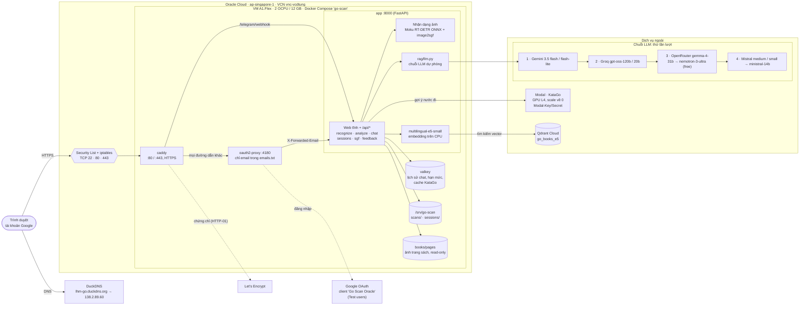

# Go Scan trên Oracle Cloud — kiến trúc

https://lhm-go.duckdns.org — VM Ampere A1 (2 OCPU / 12 GB, Ubuntu 22.04 aarch64) ở `ap-singapore-1`, chạy bằng
`deploy/oracle/compose.yaml` với profile `duckdns`. Cách dựng: `deploy/oracle/README.md`.

## Luồng chính

| Bước | Đi qua |
|---|---|
| Vào trang | DuckDNS → Security List/iptables (443) → Caddy (HTTPS) → oauth2-proxy (Google, `emails.txt`) → app |
| Chụp bàn cờ | `/api/recognize`: Moku RT-DETR + image2sgf → ma trận bàn cờ, ảnh lưu ở `/srv/go-scan/scans` |
| Gợi ý nước đi | `/api/analyze` → KataGo trên Modal (khởi động nguội ~20–30 s), kết quả cache trong Valkey |
| Hỏi trợ lý / sách | `/api/chat` → e5 embedding → Qdrant → chuỗi LLM (model đầu tiên trả lời được thì dùng) → trích dẫn ảnh trang sách |
| Ván / review | `/api/sessions`, `/api/sgf` → `/srv/go-scan/sessions` (theo email) |

## Vận hành

- SSH: `ssh -i ~/.ssh/oracle-vm.key ubuntu@138.2.89.60`; app không qua đăng nhập: `ssh -L 8765:localhost:8765 …`.
- Cập nhật: rsync code từ máy dev (không ghi đè `deploy/oracle/.env`, `emails.txt`), rồi
  `docker compose -f deploy/oracle/compose.yaml --env-file deploy/oracle/.env up -d --build`.
- Bí mật chỉ nằm trong `deploy/oracle/.env` trên VM: Google OAuth, cookie, Gemini, Qdrant, Groq, OpenRouter, Mistral,
  Modal token.
