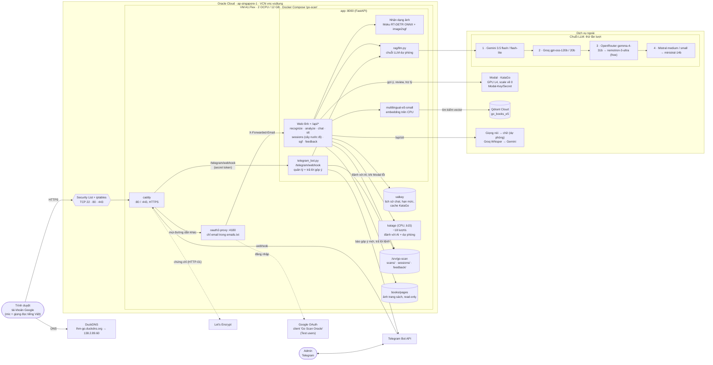

# Go Scan trên Oracle Cloud — kiến trúc

https://lhm-go.duckdns.org — VM Ampere A1 (2 OCPU / 12 GB, Ubuntu 22.04 aarch64) ở `ap-singapore-1`, chạy bằng
`deploy/oracle/compose.yaml` với profile `duckdns`. Cách dựng: `deploy/oracle/README.md`. Đây là bản triển khai duy
nhất: bản Cloud Run cũ trên Google Cloud đã gỡ ngày 6/10/2026 (dữ liệu chuyển sang VM, xem `deploy/README.md`).

## Luồng chính

| Bước | Đi qua |
|---|---|
| Vào trang | DuckDNS → Security List/iptables (443) → Caddy (HTTPS) → oauth2-proxy (Google, `emails.txt`) → app |
| Chụp bàn cờ | `/api/recognize`: Moku RT-DETR + image2sgf → ma trận bàn cờ, ảnh lưu ở `/srv/go-scan/scans` |
| Gợi ý nước đi | `/api/analyze` → KataGo trên Modal (khởi động nguội ~20–30 s), kết quả cache trong Valkey; Modal lỗi hoặc hết credit → KataGo CPU trên VM (200 lượt), thử lại Modal sau 5 phút |
| Đánh với AI | `/api/play` → luôn KataGo CPU trên VM (100 lượt tìm, ~5,5 s một nước), không tốn credit Modal |
| Hỏi trợ lý / sách | `/api/chat` → e5 embedding → Qdrant → chuỗi LLM (model đầu tiên trả lời được thì dùng) → trích dẫn ảnh trang sách |
| Ván / review | `/api/sessions`, `/api/sgf` → `/srv/go-scan/sessions` (theo email); mỗi ván lưu cả **cây nước đi** (mọi nhánh đã thử, nhánh đang sáng) |
| Hỏi bằng giọng nói | Trình duyệt tự nhận giọng (Chrome, Safari, `vi-VN`); không có thì ghi âm → `/api/stt` → Groq Whisper (dự phòng Gemini). Câu trả lời đọc bằng giọng tiếng Việt của máy (`speechSynthesis`) |
| Góp ý | `/api/feedback` → `/srv/go-scan/feedback`; luồng nền: AI viết câu trả lời công khai (chuỗi `feedback`, câu mẫu khi AI lỗi) → bot báo admin qua Telegram |
| Bot admin | Telegram → Caddy (`/telegram/webhook`, không qua đăng nhập) → app kiểm tra secret + chat id admin → lệnh `/reviews`, `/summary`, `/reply`, `/draft`, `/autoreply`… |
| Báo cáo tài nguyên | app đếm giờ GPU Modal, lượt AI, giọng nói (`usage.py` → `/srv/go-scan/usage`) → 8 giờ sáng bot gửi admin số liệu, chi phí dự kiến tháng, cảnh báo vượt ngân sách (0) |

## Vận hành

- SSH: `ssh -i ~/.ssh/oracle-vm.key ubuntu@138.2.89.60`; app không qua đăng nhập: `ssh -L 8765:localhost:8765 …`.
- Cập nhật: rsync code từ máy dev (không ghi đè `deploy/oracle/.env`, `emails.txt`), rồi
  `docker compose -f deploy/oracle/compose.yaml --env-file deploy/oracle/.env up -d --build`.
- Bí mật chỉ nằm trong `deploy/oracle/.env` trên VM: Google OAuth, cookie, Gemini, Qdrant, Groq, OpenRouter, Mistral,
  Modal token, Telegram (token, webhook secret, chat id admin). Bản sao dự phòng của Modal / Telegram token còn trong
  Secret Manager của project Google Cloud (project đó vẫn giữ OAuth client "Go Scan Oracle").
- oauth2-proxy chờ app tối đa 240 s (`OAUTH2_PROXY_UPSTREAM_TIMEOUT`): câu hỏi về thế cờ khi GPU Modal khởi động nguội
  lâu hơn mặc định 30 s, trước đây bị cắt thành lỗi 502.
- Đổi webhook bot (khi đổi tên miền): `docker compose … exec app python -m telegram_bot set-webhook https://<DOMAIN>/telegram/webhook`.
- Dữ liệu người dùng chỉ có ở `/srv/go-scan` trên VM (file do container ghi, chủ sở hữu root): nên bật backup policy
  cho boot volume.

## Đã gỡ

| Ở đâu | Đã xoá |
|---|---|
| Google Cloud `project-1a0ed8d8-…` | Cloud Run `go-scan`, `go-scan-bot`; Artifact Registry `go-scan`; bucket `…-go-scan`; service account `go-scan-run`, `go-katago-run` |
| Repo | `deploy/gcp.sh`, `deploy/iap-oauth.sh`, `infrastructure.puml` |
